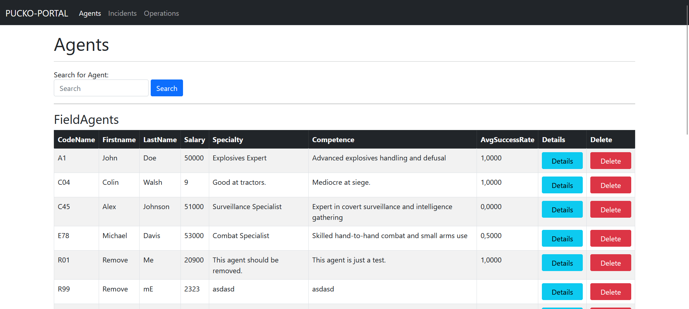
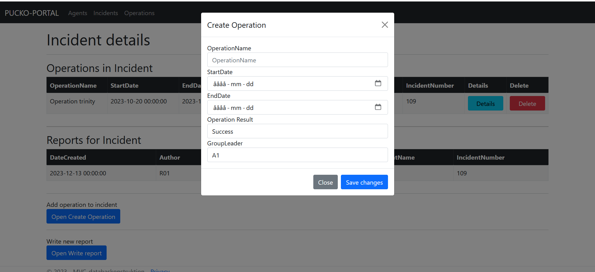

# MVC Database Project Overview

This repository showcases an ASP.NET MVC rewrite of a previous [PHP database project](https://github.com/LindholmLabs/PHP-databaskonstruktion). It illustrates the development of a web-based interface for managing database operations, emphasizing efficient data handling and secure user interaction in an MVC environment.

## Project Features

### Modal Form Generation
- **ModalBuilder**: Streamlines creating input forms for database tables through the use of partials.
- **ASP.NET Core Integration**: Utilizes "secrets" files for securely storing database connection parameters.
- **Generic Functionality**: Adapts to various database tables for data insertion or modification.

### Data Handling and Database Interaction
- **DatabaseRepository Class**: Manages incoming data from forms, organizing it into key-value pairs for database interaction.
- **Dynamic SQL Query Generation**: Constructs "INSERT" queries based on provided data, safeguarding against SQL injections.

### List Input Handling
- **Automated Dropdown Generation**: Facilitates selection of foreign composite primary keys.
- **Seamless Database Connectivity**: Leverages "GetTable" function for fetching entire database tables or specific columns.

### Search Implementation
- **Character Matching**: Employs SQL "LIKE" queries for effective data searching based on user input.
- **Controller-Model Interaction**: Efficiently processes search parameters and returns the relevant data.

### Data Modification
- **Dynamic ActionLinks**: Creates links for each table row, enabling data deletion or detailed view.
- **DeleteRow Function**: General method for deleting data based on primary key values, enhancing code reusability.

### Stored Procedure Execution
- **Procedure Handling**: Executes stored procedures like "GetOperationsInRange" based on user-defined date ranges.

### Table Display
- **TableBuilder Class**: Constructs table objects that are rendered using a "_TablePartial".
- **Dynamic Header Generation**: Automatically creates table headers from database column names.

### Dynamic Link Generation
- **Flexible URL Creation**: Generates links for data deletion or detailed views using "RouteValueDictionary".

### Hidden Field Usage
- **Contextual Data Submission**: Employs hidden fields in forms to pass pre-determined data like incident names and numbers, if the user has previosly selected an incident or other table with support for detail views.

## Repository Details

- **Codebase**: The project's code and implementation details can be accessed in the repository.
- **Database**: View [database implementation](https://github.com/LindholmLabs/PHP-databaskonstruktion/blob/a3a5f0a6822ac9531281a3530e60e70374d1669f/src/database.md) in original PHP-project.
- **MVC Approach**: Highlights the transition from PHP to ASP.NET MVC, showcasing the application of the MVC architectural pattern.
- **Paper**: View academic paper here: [MVC_report_sv.pdf](src/MVC-applikation_rapport.pdf)